# GenAI Development/project Life Cycle
The development lifecycle of a GenAI (General Artificial Intelligence) project involves multiple phases, each with specific tasks and considerations to ensure the successful creation, deployment, and maintenance of the AI system. Here's an overview of the typical lifecycle:

1. **Define the Use Case** <br>
*Objective:* Identify and articulate the problem or opportunity the AI solution will address.<br>
*Tasks:* <br>
    - Conduct stakeholder analysis to understand user needs and requirements.
    - Perform a feasibility study to evaluate if AI is the right solution.
    - Set clear goals and define success metrics (KPIs).
2. **Research and Choose the Model** <br>
*Objective:* Select the most suitable AI model for the given use case.<br>
*Tasks:* <br>
    - Review literature and existing models that solve similar problems.
    - Consider the trade-offs between different model types (e.g., complexity, interpretability, resource requirements).
    - Evaluate the potential of pre-trained models for transfer learning.
3. **Data Collection and Preprocessing** <br>
*Objective:* Gather and prepare high-quality data to train the model.<br>
*Tasks: * <br>
    - Identify data sources (internal databases, public datasets, etc.).
    - Clean and preprocess data (handle missing values, outliers, normalization).- NLP
    - Split data into training, validation, and test sets.
4. **Model Training and Adaptation** <br>
*Objective:* Train the AI model using the collected data.<br>
*Tasks:*<br>
    - Choose appropriate training algorithms and settings. Fine tune, Prompt tune
    - Perform fine-tuning and optimization of model parameters.
    - Use validation data to monitor and prevent overfitting.
5. **Model Evaluation** <br>
*Objective:* Assess the model's performance and ensure it meets the predefined criteria.
*Tasks:*<br>
    - Evaluate the model using test data.
    - Benchmark against baseline models and other relevant metrics.
    - Perform error analysis to identify areas for improvement.
6. **Model Tuning and Augmentation** Lanchain/Llamaindex<br>
*Objective:* Enhance the model's performance and robustness.
*Tasks:*<br>
    - Conduct hyperparameter tuning using techniques like grid search or random search.
    - Implement feature engineering to improve model inputs.
    - Perform cross-validation to ensure the model generalizes well.
7. **Deployment** <br>
*Objective:* Deploy the AI model in a production environment.<br>
*Tasks:*<br>
    - Choose a deployment platform (cloud services like AWS, Google Cloud, or Azure).
    - Set up a continuous integration/continuous deployment (CI/CD) pipeline.
    - Implement monitoring and logging systems to track model performance and detect issues.
8. **Monitoring and Maintenance** <br>
*Objective:* Ensure the AI system continues to perform well and adapt to new requirements.
*Tasks:* <br>
    - Monitor key performance metrics and set up alerts for anomalies.
    - Regularly update the model with new data to maintain accuracy.
    - Collect and incorporate user feedback to improve the system.
    - Perform regular audits to ensure ethical and unbiased AI practices.
9. **Scalability and Optimization**- <br>
*Objective:* Ensure the AI solution can handle increasing demands efficiently.
*Tasks:*<br>
    - Optimize the model for performance and cost-efficiency.
    - Implement scalability measures (e.g., load balancing, distributed computing).
    - Continuously review and refine the infrastructure and deployment setup.
10. **Documentation and Knowledge Sharing**
*Objective:* Maintain comprehensive documentation to facilitate understanding and collaboration.
*Tasks:*<br>
    - Document the development process, including model choices, data preprocessing steps, and training procedures.
    - Share insights and best practices with the team and wider community.
    - Ensure reproducibility of the AI solution through detailed records.
11. **Ethics, Security, and Compliance** <br>
*Objective:*  Ensure the AI system operates ethically, securely, and in compliance with regulations.
*Tasks:*<br>
    - Conduct ethical reviews and bias audits regularly.
    - Implement data security measures to protect sensitive information.
    - Ensure compliance with relevant regulations (e.g., GDPR, HIPAA).
`By following these phases systematically, you can effectively develop, deploy, and maintain a GenAI project that is robust, efficient, and aligned with user needs and ethical standards.`

## LLM and GenAI
Ability to understand and processing text like human. Trained on large amount of data and can be fine tuned for specific usecase. built on top of Transformer architecture  <br>
GenAI refers to a specific subset of AI that uses programs to process large data sets, detect patterns, and then create new works of text, imagery, video, and even computer code based on the instructions it’s given (known as “prompts”). GenAI relies on artificial neural networks. GenAI leverages the power of LLMs to create new content. <br>
In context of modren use case (GPT ot Gemini):
- LLMs - Understands the user queries and generates the response
- GenAI - Generates a new text from repsonse/result send by the LLM 
# Introdcution to Langchain For RAG based GenAI development
Langchain is a framework for developing applications powered by large language models (LLMs). LangChain simplifies every stage of the LLM application lifecycle: 
- Development: Build your applications using LangChain's open-source building blocks and components. Hit the ground running using third-party integrations and Templates. 
- Productionization: Use LangSmith to inspect, monitor and evaluate your chains, so that you can continuously optimize and deploy with confidence. 
- Deployment: Turn any chain into an API with LangServe. LangServe - Deploy LangChain chains as REST APIs.
- Maintain and Monitor : with LangSmith. LangSmith is a platform for building production-grade LLM applications<br>
Helps with bridging the gap between complex AI technologies and practical, everyday applications.
[https://www.langchain.com/](https://www.langchain.com/)

- Langchain simplifies the connection between various LLM models to data for specific task completion with capabilities of LLM.

## Orchestration Framework for GenAI powered application development
- Open Source - Obstraction alogorithm - Modular Design - Sophisticated cutting edge ML algorithm   
- Centralized development of LLM powered applicatins - easy of configuring LLM models
- Intigrating Data and  Data preprocessing/text splitter, storing
- prompt template - to format prompts
- Chains - connecting LLM model with prompt and data(vector data base) for comminication between human and LLM.  Chains empower us to integrate numerous components, weaving them into a cohesive application.
A chain is crafted to take in user input, polish it using a PromptTemplate, and subsequently pass on this refined response to a large language model (LLM) - `LLMChain, Sequential Chain, Router Chain, load_summarize_chain, RetrievalQA` <br>
[https://www.analyticsvidhya.com/blog/2023/10/a-comprehensive-guide-to-using-chains-in-langchain/#:~:text=A1%3A%20LangChain%20is%20a%20sophisticated,the%20development%20of%20intelligent%20applications.](https://www.analyticsvidhya.com/blog/2023/10/a-comprehensive-guide-to-using-chains-in-langchain/#:~:text=A1%3A%20LangChain%20is%20a%20sophisticated,the%20development%20of%20intelligent%20applications.)

- Summarization Techniques - `load_summarize_chain`
    - Stuffing method (prefered small documnets )
    - MapReduce method (Muti stage summarization -two prompts)
    - Refine method (single call mutiple summaries. summary of summaries - two prompts)
```
from langchain.chains import SimpleSequentialChain
from langchain.chains import LLMChain

chain = LLMChain(llm=llm, prompt=prompt, verbose=True)

overall_simple_chain = SimpleSequentialChain(chains=[chain_one, chain_two], verbose=True )
```
- Memory - Ontrack, retain conversation. better/improved responses
- Agents -  Reasoning and action (Act- Search, API CALLs), Extensive adaptability and flexibility - `expernal source`, Access to memory. Agents makes LLM to `plan, think and Act the respond`.

## Architecture
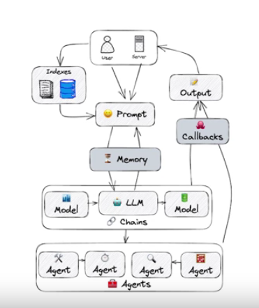
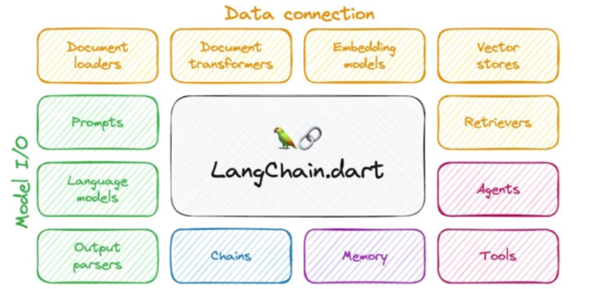
**Use Cases**
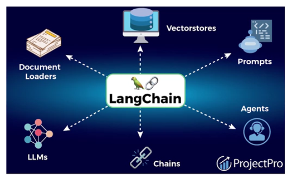
Q&A, chat bots, Summarization of documents, Virtual agents, Data Augumnetation

- `Document Loader > Text Spliterr > Embeddings > Vector store`
- `Document Loader  > Prompt > Model > Output parser`
- `Retreiver >Prompt > Chat model`
```
from langchain.output_parsers import StructuredOutputParser, ResponseSchema
from langchain.prompts import ChatPromptTemplate, HumanMessagePromptTemplate
from langchain.llms import OpenAI
from langchain.chains.summarize import load_summarize_chain
from langchain.chains import _RetrivalQA


from langchain.llms import OpenAI
from langchain.chains.summarize import load_summarize_chain

# LLM by OpenAI 
llm = OpenAI(temperature=0.9)

# create a chain instance with OpenAI LLM with map_reduce chain type
chain = load_summarize_chain(llm, chain_type="map_reduce")
chain.run(docs)
```
[https://analyticsvidhya.com/blog/2023/09/fundamental-principles-of-langchain-in-llm-based-application-development/](https://analyticsvidhya.com/blog/2023/09/fundamental-principles-of-langchain-in-llm-based-application-development/)
Vector Search process: Encode the input, convert into indexes and search in vectore store
- Similarity search is one of the fastest-growing domains in AI and machine learning. At its core, it is the process of matching relevant pieces of information together. (vecore search)
- Semantic search aims to understand the meaning and context of the query to find relevant information, even if there are no exact keyword matches.

**the framework consists of the following open-source libraries:**

- `langchain-core:` Base abstractions and LangChain Expression Language.
- `langchain-community:` Third party integrations.
    - `Partner packages` (e.g. langchain-openai, langchain-anthropic, etc.): Some integrations have been further split into their own lightweight packages that only depend on langchain-core.
- `langchain:` Chains, agents, and retrieval strategies that make up an application's cognitive architecture.
- `LangGraph:` Build robust and stateful multi-actor applications with LLMs by modeling steps as edges and nodes in a graph. Integrates smoothly with LangChain, but can be used without it.
- `LongServe:` Deploy LangChain chains as REST APIs.
- `LangSmith:` A developer platform that lets you debug, test, evaluate, and monitor LLM applications.

## Build an Agent
By themselves, language models can't take actions - they just output text. A big use case for LangChain is creating agents. Agents are systems that use LLMs as reasoning engines to determine which actions to take and the inputs to pass them. After executing actions, the results can be fed back into the LLM to determine whether more actions are needed, or whether it is okay to finish.
## Setup
0. setup python environment.
1. install langchain and LLM model API
2. set LLM key on os environment
3. import llm from lanchain and configure the model with choosen foundation model API and key
4. format the prompts with prompt template created with input variable and template by importing promptTemplate from langchain.prompts
6. invoke the LLM or LLM chain with prompt created .
7. parse the output reponse received from LLM.

### RAG Architecture - Retrival-Augumented Generation (context aware , Prompt tuning)
`Loading data, embedding, storing into vector database, querying, and retrieving the data`
1. Loading Data with documnet loader
2. pre-process and chunk the data with text splitters (`optional`)
3. convert into embeddigs with configured embeddig model and store on choosen vectore store collection - easy for `sematic search`t
4. create a `retriver` for imtermediatory to get relevant context 
```
# Expose index to the retriever
retriever = machineIndex.as_retriever(
    search_type="similarity",
    search_kwargs={
        "k": NUMBER_OF_RESULTS,
        "search_distance": SEARCH_DISTANCE_THRESHOLD,
    },
    filters=None,
)

qa = RetrievalQA.from_chain_type(
    llm=llm,
    chain_type="stuff",
    retriever=retriever,
    return_source_documents=True,
    verbose=True,
    chain_type_kwargs={
        "prompt": PromptTemplate(
            template=qandaprompttemplate,
            input_variables=["context", "question"],
        ),
    },
)
```
The memory module in LangChain is designed to remember past conversations, ensuring continuity and context in user interactions. 
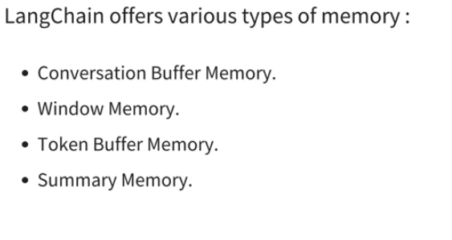

## Why LangChain?
-  The best way to understand the benefits of LangChain is to understand these Components and how the work together to make it easier to build robust LLM based Applications.
<br>

**Let's explore the main ideas of the modules in relation to the Langchain**
Latest and advacned updated is LangChain Expression Language (LCEL), here chaining made simple with runnable interface.
1. **Model IO** <br>
Model IO focuses on basic LLM inputs and outputs. This replicates a lot of the functionality already present in default APIs, such as the OpenAI API.
- LangChain Advantage:
  - Model IO is standardized, allowing you to easily switch between LLMs in the future and supports both Text Completion APIs and Chat Interface APIs.

# LLMs with with LangChain
There are two main types of APIs in Langchain:
- LLM
`from langchain.llms import OpenAI {choosen model}`
  - Text Completion Model: Returns the most likely text to continue
- Chat
`from langchain.chat_models import ChatOpenAPI {choosen API}`
  - Converses with back and forth messages, can also have a "system" prompt.
1. Chat Models <br>
Chat Models have a series of messages, just like a chat text thread, except one side of the conversation is an Al LLM. Langchain creates 3 schema objects for this:
- System Message - General system tone or personality Human Message
- Human request or reply
- AIMessage: Al's reply
# Prompting With Langchain
Lanchain prompt API formats the input prompts with template and input variables if chat or conversation completion is not zero-shot prompting. <br>
`from langchain_core.prompts import PromptTemplate`<br>
`from langchain.schema import AIMessage, HumanMessage, SystemMessage` <br>

# Output parser with Langchain
Parsers: Consist of two key elements:
  - format_instructions
     - An extra string that Langchain adds to the end of a prompt to assist with formatting.
  - parse() method: 
     -  A method for using eval() internally to parse the string reply to the exact Python object you need.
`from langchain.output_parsers import CommaSeparatedListOutputParser`
```
= chat_prompt.format_prompt(request='give me 5 characteristics of dogs',
format_instructions=output_parser.get_format_instructions())|
= ChatPromptValue(messages=[HumanMessage(content='give me 5 characteristics of dogs\nYour resp onse should be a list of comma separated values, eg: `foo, bar, baz`', additional_kwargs={}, example=False)])

```

```
from langchain.output_parsers import PydanticOutputParser
from pydantic import BaseModel, Field
class Scientist (BaseModel):
    name: str Field(description='Name of a Scientist')
    discoveries: list Field (description="Python list of discoveries")
parser =PydanticOutputParser (pydantic_object=Scientist)
```

# Serialization
- You may find yourself wanting to save, share, or load prompt objects.
- Langchain allows you to easily save Prompt templates as JSON files to read or share.
Let's explore this further with some examples!
```
prompt = PromptTemplate(template=template, input_variables=["planet"])
prompt.save("myprompt.json")
 from langchain.prompts import load_prompt
loaded_prompt = load_prompt("myprompt.json")
 loaded_prompt

```

2. **Data connections** <br>
 Data Connection focuses on connecting an LLM Model to a data source, such as your own documents or a vector store. Connecting Data source to Models 
- LangChain Advantage: <br>
    -  Easily swap vector store• Agents are the most powerful part of LangChain. Utilizing Models, Data Connections, Chains, and Memory, Agents can use tools to reason through requests and perform actions based on observational outputs.
# Document Loader
- Langchain comes with built-in loader tools to quickly load in files to its own Document object. 
- Note that many of these loaders require other libraries, for example PDF loading requires the pypdf library and HTML loading requires the Beautiful Soup library. Make sure to pip install the required libraries before using the loader (the loaders will inform you if they can't find the installed libraries)
`from lanchain.document_loaders import PDFLoader CSVLoader BSHTMLLoader HNLoader WikipediaLoader`
```
loader = CSVLoader("some_data/penguins.csv")
data = loader.load()

def load_docs(directory):
  loader = DirectoryLoader(directory)
  documents = loader.load()
  return documents

documents = load_docs(directory)
len(documents)
```
# Embeddings with Langchain
- Langchain provides Document Transformers that allow you to easily split strings from Document page_content into chunks.
- Choose e embbed model careful, when switching model need to again create embeddings fro document
- These chunks will then later serve as useful components for embeddings, which we can then look up using a distance similarity later on.
<br>
the most common splitters:
- Splitting on a Specific Character
- Splitting based on Token Counts

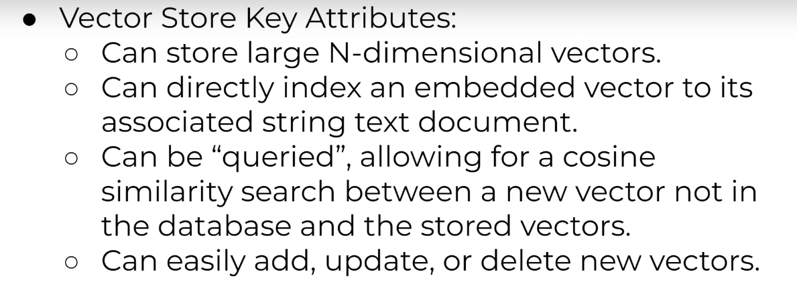
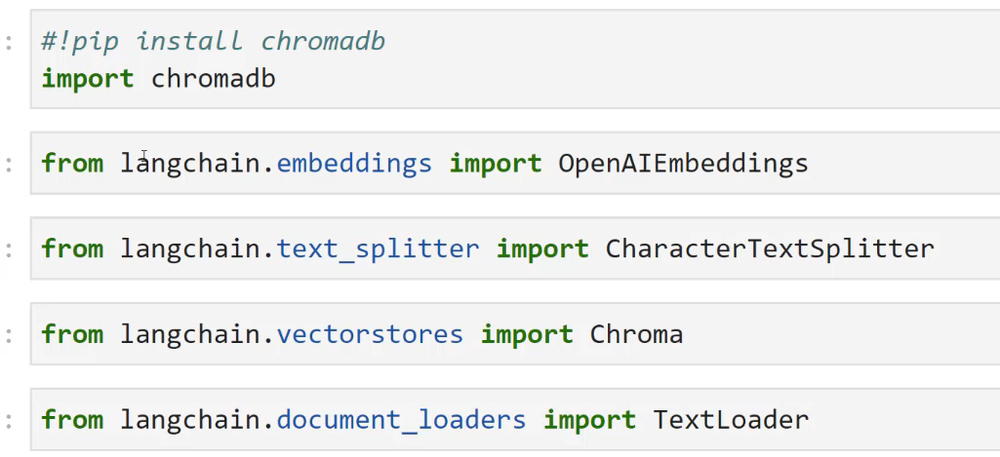

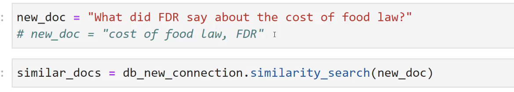
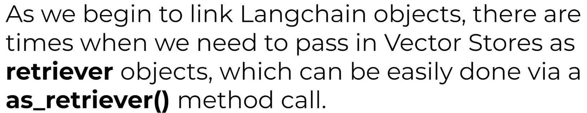
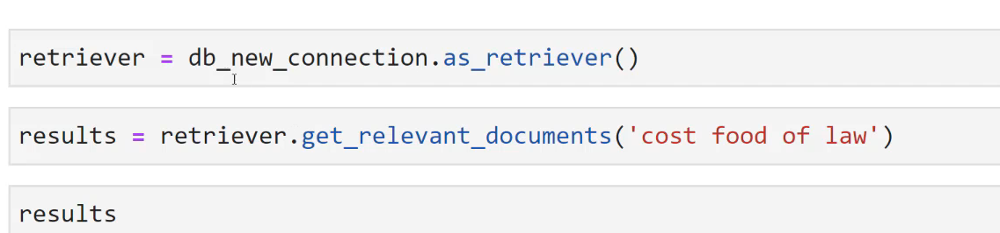

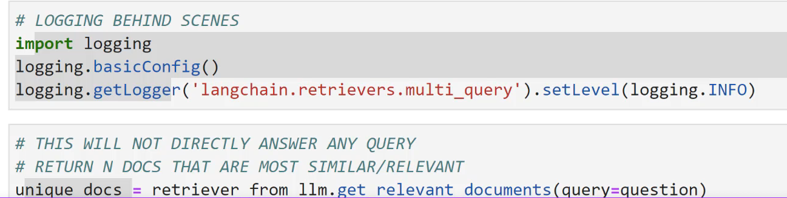

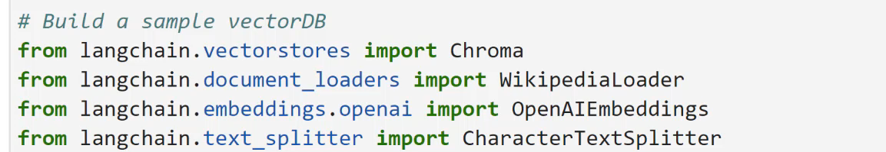

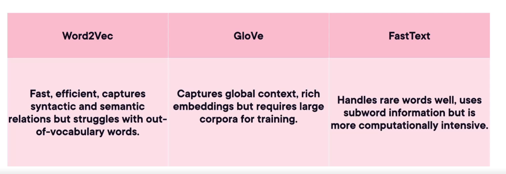
3. **Chains:** <br>
Chains allows you to link the output of one model to be the input of another model call. 
- LangChain Advantage:
   - Easily chain together different LLM calls to separate out work between models, allowing you to swap LLMs in the middle of a chain easily.
- Chains allows us to link the output of one LLM call as the input of another call.
- Langchain also provides many built-in chain functionalities, like chaining document similarity searches with other LLM calls, actions that we previously constructed manually with Langchain.
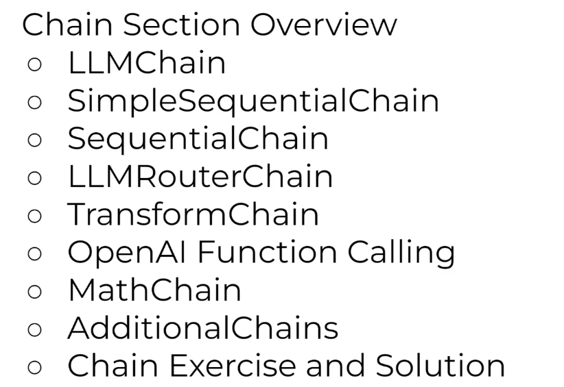
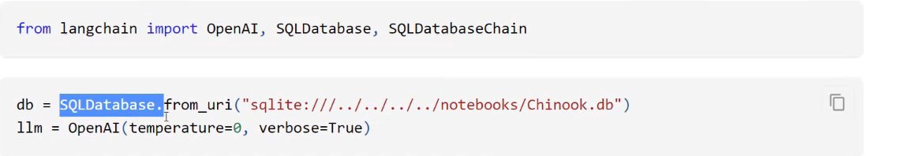
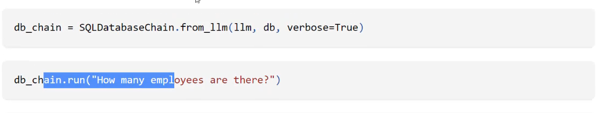
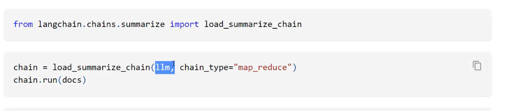
4. **Memory:**<br>
Memory allows your models to retain historical context of previous interactions. Keeping track of message intraction history. pass memory as extra argumnet when creating LLM model
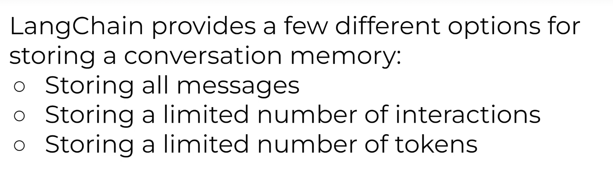
-  LangChain Advantage:
    - Easily save historical conversations or results from LLMs or Chat Models and reload them for future use.
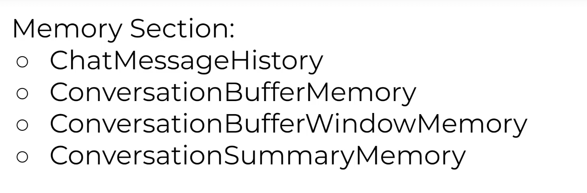
5. Agents <br>
`from langchain.agents import load_tools, initialize_agent, AgentType` <br>
Agents are the most powerful part of LangChain. Utilizing Models, Data Connections, Chains, and Memory, Agents can use tools to reason through requests and perform actions based on observational outputs.<br>
At their core, agents allow LLMs to connect to tools (e.g. Wikipedia, Calculator, Google Search, etc...) and conduct a structured approach to complete a task based on ReAct: Reasoning and Acting.
- Agent that has access to list of tools
- LangChain Advantage:
    - Create agents and custom tools with just a few lines of code!s (ChromaDB).<br>
    - Integrate with many different data sources to create standardized document objects from a variety of sources (CSVS, PDFs, AWS, Google Cloud, etc...).

```
agent = initialize_agent(tools, llm, agent=AgentType.ZERO_SHOT_REACT_DESCRIPTION)
agent.run("What is 134292 times 29384920?")

```
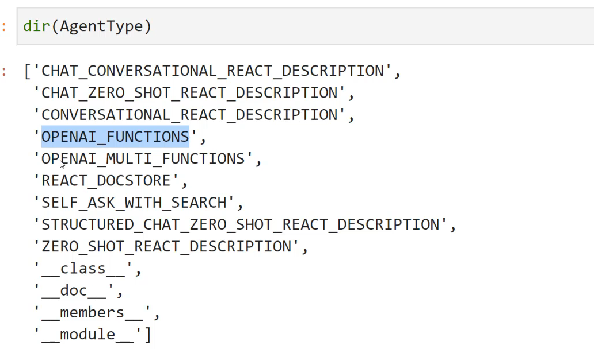
1. Import agent libraries
2. set up tools and llm model
3. initialize agent with list of tools
4. mets LLM to decide which tool is needed once prompted.

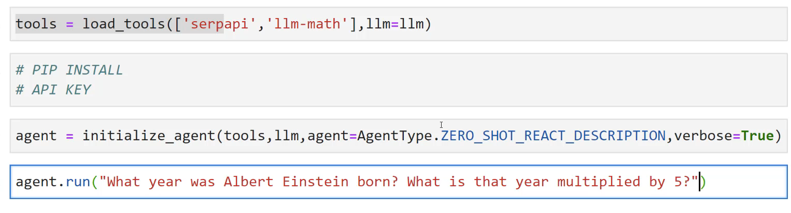

# Prompt Engineering
Ability or skill to craft and refine prompts such way that LLM responds concice and clear response, and it is skill to utilize the full potential of LLM to task done.
- high level of precision in response
- increased perfomance -optimized and expected results 
```
Prompt Engineering is the ability to craft and refine input instructions for generative AI engines.
Developers use prompt engineering to design robust and effective prompting techniques that interface with LLMs and other tools.
```
- well defined goal and Structured prompts
  -  Persona
  - Instruction - specific task or instruction giveb to LLM to perfom
  - Context - extra knowloedge
  - ouptut format indicator
- making better way to achieve and comunicating with LLM for use cases such as Classification - Sentiment Analysis, Summarization, Text extraction&Format, Tansalation, Q&A, Coding and Image Generation  e.t.c

## Getting started on Prompt Engineering
Create effective prompts, evaluate prompt performance, using advanced prompt techniques, ethical considerations and best practices and future directions.

<br>

**Common Challenges in Prompt Engineering** <br>
- Model Bias
- Unpredctability
- Lack of real world Knowledge (Hallucination)
- Language and Cultural Nuances

### Evaluating 
- Acuuracy
- Speed
    - Processing Speed
    - Response Speed
- Relevancy
- Clarity

### Prompt Technique
- Zero shot prmpting - no context
- few shot prompting - few context about what to do how to do
- Chain of thought - Reasoning - moduler(Step by Step) achievement 
- Generated Knowledge Prompting- Context aware 
### Ethical Concerns
- Privacy 
- Misinformation
- Bias/Information
- Ownership/Copyright
- Transparency
Use Prompt engineering to mitigate above concerns by specifying in prompt 

### Trends And Future
1. Conversational AI
- Chat GPT
- Copilot/bing
- Google Bard/ Gemini/ Palm
- Amazon Bedrock
- Jasper
- YouChat
2. MultiModal GenAI
- Text, Video, Audio, Images
3. Code Generation
- GitHub Copilot/ Copilot X
- Replit GhostWriter
- Amazon CodeWhisper
- Tabnine
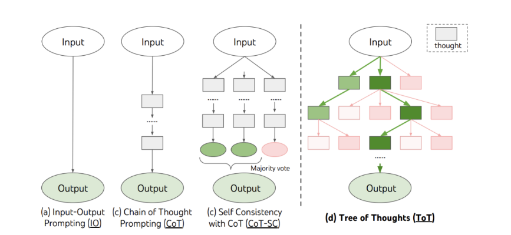

# Handling Embeddigs with Langchain
Embeddings are numerical representations of text data, crucial for semantic search and other AI applications. In Langchain, effectively managing embeddings involves several key aspects:

## Creating Embeddings
- **Choose an embedding model:** Select an appropriate embedding model based on your data and use case. Popular options include OpenAI's text-embedding-ada-002, Sentence Transformers, and Hugging Face's Sentence-Transformers.<br>
- **Preprocess text:** Clean and preprocess your text data to ensure optimal embedding quality. This may involve tokenization, stop word removal, stemming, or lemmatization. <br>
- **Generate embeddings:** Use the chosen embedding model to create numerical representations of your text data.<br>
## Storing Embeddings
- **Vector database:** For large datasets, consider using a vector database like Pinecone, Weaviate, or FAISS. These databases are optimized for storing and searching high-dimensional vectors.
- **Local storage:** For smaller datasets, you can store embeddings locally in a list or NumPy array. However, this approach might not be scalable for large-scale applications. <br>
## Updating Embeddings 
- **Incremental updates:** For dynamic datasets, implement a process to update embeddings periodically or based on specific triggers (e.g., new documents added). <br>
- **Full re-embedding:** For significant changes to the dataset or embedding model, consider re-embedding the entire dataset.
- **Delta updates:** For large datasets, explore techniques like delta embedding or approximate nearest neighbors (ANN) to update only a subset of embeddings. <br>
## Using Embeddings in Langchain
- **Vector search:** Use the vector database to find the most similar embeddings based on a query embedding.
- **Retrieval augmented generation (RAG):** Combine embeddings with language models to generate improved responses by retrieving relevant information from the vector database.
- **Semantic search:** Find relevant documents or information based on semantic similarity. <br>


## Strategies for Efficient Updates

**Incremental Updates:** <br>

- Identify changed documents: Determine which documents have been modified or added since the last update.
- Re-embed changed documents: Create new embeddings for the modified documents.
- Update vectorstore: Use the vectorstore's update or upsert functionality to modify existing embeddings or add new ones.
**Delta Embeddings:** <br>

- Calculate delta embeddings: Compute the difference between old and new embeddings.
- Update vectorstore: Apply the delta embeddings to the existing vectors.<br>
Note: This method requires careful implementation and might not be suitable for all embedding models.
**Hybrid Approach:**<br>

- Combine incremental updates and full re-embedding based on update frequency and dataset size.
- For frequent updates and small datasets, incremental updates might be sufficient.
- For infrequent updates and large datasets, full re-embedding might be more efficient.

```
from langchain.vectorstores import Pinecone

def update_vectorstore(vectorstore, new_texts, new_embeddings):
  """Updates the vectorstore with new texts and embeddings.

  Args:
      vectorstore: The vectorstore instance.
      new_texts: A list of new texts.
      new_embeddings: A list of new embeddings corresponding to the new texts.
  """

  for text, embedding in zip(new_texts, new_embeddings):
      vectorstore.add_texts([text], embeddings=[embedding])

# Example usage:
# Assuming you have a list of updated texts and their corresponding embeddings
updated_texts = ["New text 1", "New text 2"]
updated_embeddings = [new_embedding1, new_embedding2]
update_vectorstore(vectorstore, updated_texts, updated_embeddings)

```
## Key Considerations
**Embedding dimensionality:** Choose an appropriate embedding dimensionality based on your dataset and computational resources. <br>
**Embedding quality:** Evaluate the quality of embeddings using metrics like cosine similarity or perplexity. <br>
**Computational efficiency:** Optimize embedding creation and search processes for performance.<br>
**Data privacy:** Consider data privacy and security implications when handling embeddings.

## Prompt flow to develop language model apps
https://learn.microsoft.com/en-us/training/modules/get-started-prompt-flow-ai-studio <br>
Prompt flow takes a prompt as input, which in the context of LLMs, refers to the query provided to the LLM application to generate a response. It's the text or set of instructions given to the LLM application, prompting it to generate output or perform a specific task.
Prompt flow allows you to create flows, which refers to the sequence of actions or steps that are taken to achieve a specific task or functionality. <br>
**Understand the development lifecycle of a large language model (LLM) app**
1. **Initialization:** Define the use case and design the solution.
    - Define the objective
    - Collect a sample dataset
    -    Build a basic prompt
    -    Design the flow
2. **Experimentation:** Develop a flow and test with a small dataset.
The experimentation phase is an iterative process during which you (1) run the flow against a sample dataset. You then (2) evaluate the prompt's performance. If you're (3) satisfied with the result, you can move on to evaluation and refinement. If you think there's room for improvement, you can (4) modify the flow by changing the prompt or flow itself.
3. **Evaluation and refinement:** Assess the flow with a larger dataset.
By testing the flow on a larger dataset, you can evaluate how well the LLM application generalizes to new data. During evaluation, you can identify potential bottlenecks or areas for optimization or refinement.
4. **Production:** Deploy and monitor the flow and application.
    - Optimize the flow that classifies incoming articles for efficiency and effectiveness.
    - Deploy your flow to an endpoint. When you call the endpoint, the flow is triggered to run and the desired output is generated.
    - Monitor the performance of your solution by collecting usage data and end-user feedback. By understanding how the application performs, you can improve the flow whenever necessary.
Finally, your news article classification application is ready for production.<br>
During both evaluation and refinement, and production, you might find that your solution needs to be improved. 

## Core components of Prompt Flow
To create a Large Language Model (LLM) application with prompt flow, you need to understand prompt flow's core components.
<br>

**Understand a flow**<br>
Prompt flow is a feature within the Azure AI Studio that allows you to author flows. Flows are executable workflows often consist of three parts:

- `Inputs:` Represent data passed into the flow. Can be different data types like strings, integers, or boolean.
- `Nodes:` Represent tools that perform data processing, task execution, or algorithmic operations.
- `Outputs:` Represent the data produced by the flow.

**Explore the tools available in prompt flow**<br>
Three common tools are:
- `LLM tool:` Enables custom prompt creation utilizing Large Language Models.
- `Python tool:` Allows the execution of custom Python scripts.
- `Prompt tool:` Prepares prompts as strings for complex scenarios or integration with other tools.
 <br>

**Understand the types of flows**
There are three different types of flows you can create with prompt flow:
- `Standard flow:` Ideal for general LLM-based application development, offering a range of versatile tools.
- `Chat flow:` Designed for conversational applications, with enhanced support for chat-related functionalities.
- `Evaluation flow:` Focused on performance evaluation, allowing the analysis and improvement of models or applications through feedback on previous runs.

## Evaluating RAG Pipelines
Ragas is a framework that helps you evaluate your Retrieval Augmented Generation (RAG) pipelines. RAG denotes a class of LLM applications that use external data to augment the LLM’s context. There are existing tools and frameworks that help you build these pipelines but evaluating it and quantifying your pipeline performance can be hard.

https://docs.ragas.io/en/stable/


## LLM Finetuning
[FineTuning](https://app.pluralsight.com/library/courses/pre-trained-llms-build-solutions/table-of-contents)