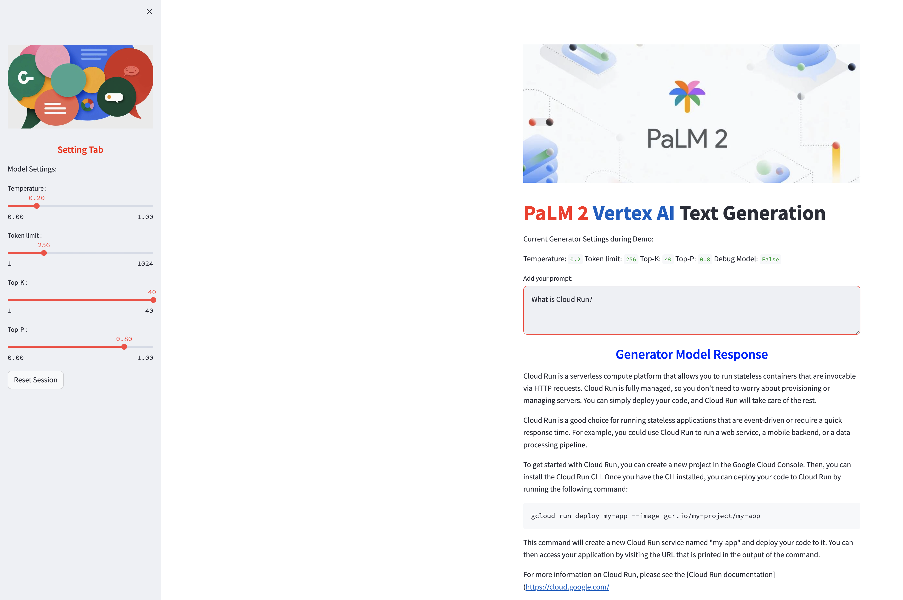

# Cloud Run application utilizing Streamlit Framework that demonstrates working with Vertex AI API

| | |
|-|-|
|Author(s) | [Romin Irani](https://github.com/rominirani) |

This application demonstrates a Cloud Run application that uses the [Streamlit](https://streamlit.io/) framework.



## Build and Deploy the Application to Cloud Run

> NOTE: **Before you move forward, ensure that you have followed the instructions in [SETUP.md](../SETUP.md).**
Additionally, ensure that you have cloned this repository and are currently in the ```chat-streamlit```. This should be your active working directory for the rest of the commands.

To deploy the Streamlit Application in [Cloud Run](https://cloud.google.com/run/docs/quickstarts/deploy-container), we need to perform the following steps:

1. Your Cloud Function requires access to two environment variables:

   - `GCP_PROJECT` : This the Google Cloud Project Id.
   - `GCP_REGION` : This is the region in which you are deploying your Cloud Function. For e.g. us-central1.
  
    These variables are needed since the Vertex AI initialization needs the Google Cloud Project Id and the region. The specific code line from the `main.py`
    function is shown here:
    `vertexai.init(project=PROJECT_ID, location=LOCATION)`

    In Cloud Shell, execute the following commands:

    ```bash
    export GCP_PROJECT='<Your GCP Project Id>'  # Change this
    export GCP_REGION='us-central1'             # If you change this, make sure region is supported by Model Garden. When in doubt, keep this.
    ```

2. We are now going to build the Docker image for the application and push it to Artifact Registry. To do this, we will need one environment variable set that will point to the Artifact Registry name. We have a command that will create this repository for you.

   In Cloud Shell, execute the following commands:

   ```bash
   export AR_REPO='<REPLACE_WITH_YOUR_AR_REPO_NAME>'  # Change this
   export SERVICE_NAME='chat-streamlit-app' # This is the name of our Application and Cloud Run service. Change it if you'd like. 
   gcloud artifacts repositories create "$AR_REPO" --location="$GCP_REGION" --repository-format=Docker
   gcloud auth configure-docker "$GCP_REGION-docker.pkg.dev"
   gcloud builds submit --tag "$GCP_REGION-docker.pkg.dev/$GCP_PROJECT/$AR_REPO/$SERVICE_NAME"
   ```

3. The final step is to deploy the service in Cloud Run with the image that we built and pushed to the Artifact Registry in the previous step:

    In Cloud Shell, execute the following command:

    ```bash
    gcloud run deploy "$SERVICE_NAME" \
      --port=8080 \
      --image="$GCP_REGION-docker.pkg.dev/$GCP_PROJECT/$AR_REPO/$SERVICE_NAME" \
      --allow-unauthenticated \
      --region=$GCP_REGION \
      --platform=managed  \
      --project=$GCP_PROJECT \
      --set-env-vars=GCP_PROJECT=$GCP_PROJECT,GCP_REGION=$GCP_REGION
    ```

On successfully deployment, you will be provided a URL to the Cloud Run service. You can visit that in the browser to view the application that you just deployed. Type in your queries and the application will prompt the Vertex AI Text model and display the response.
